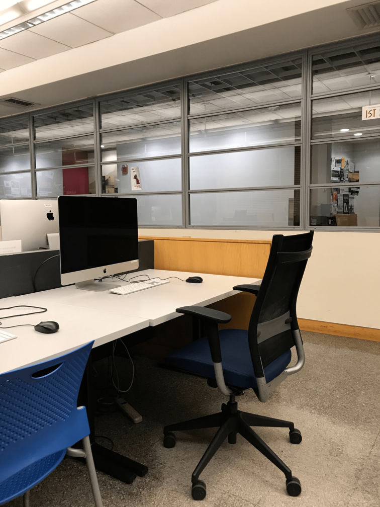
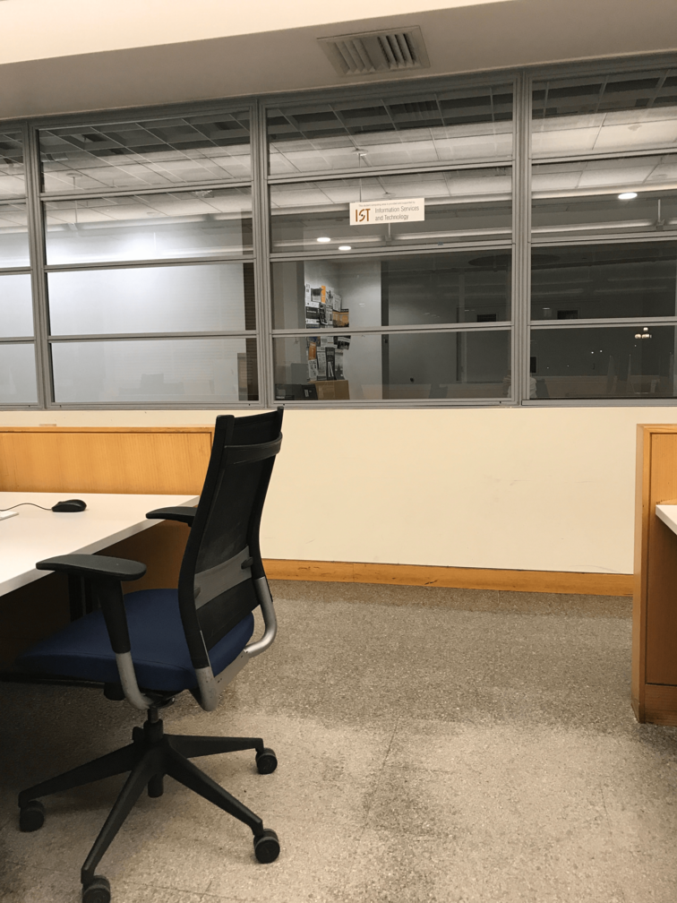
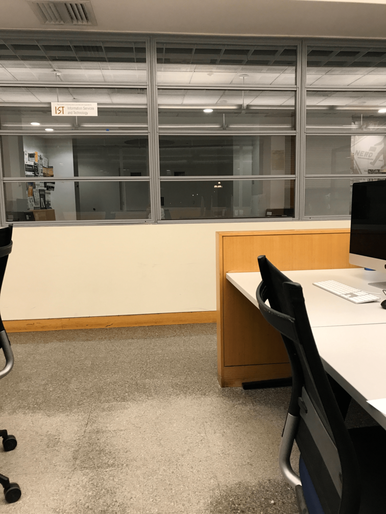
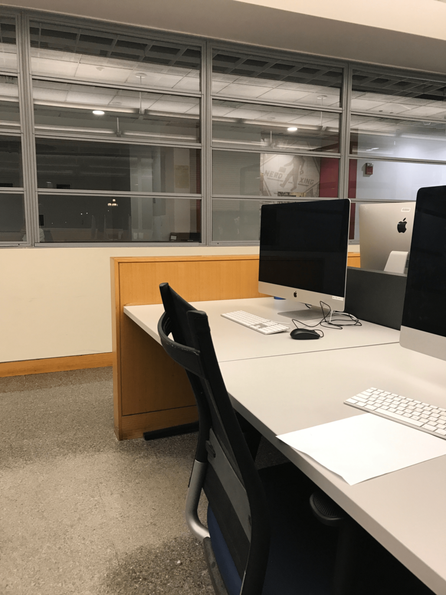
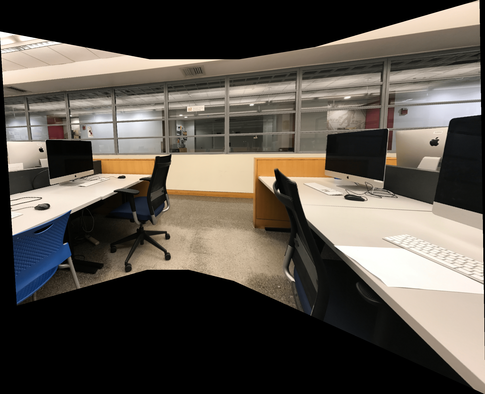

# Panorama-Stitching

Takes two or more images as input and automatically outputs a panorama image where the first image is warped into the domain of the others.

A course project for 6.865 Computational Photography.

## Implemented in this project:

- Harris corner detection
- Patch descriptor
- Correspondences using nearest neighbors (NN) and the second NN test
- RANSAC
- Fully automatic panorama stitching of two or more images
- Linear blending
- Two-scale blending
- Mini Planets

## Sample Input

## Sample Output

